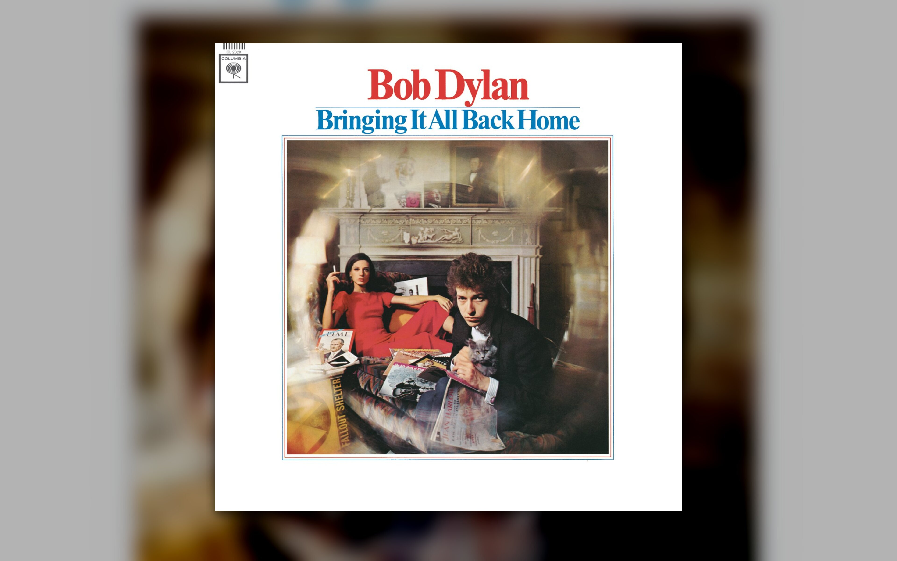
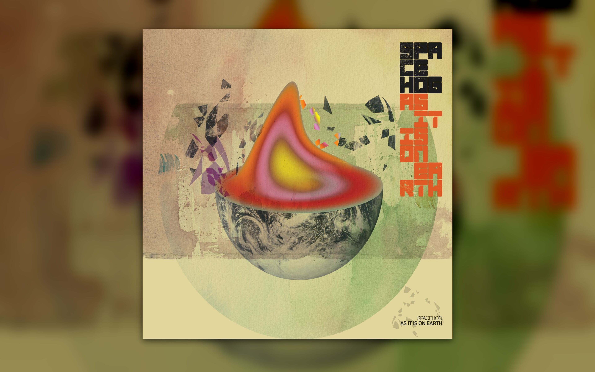
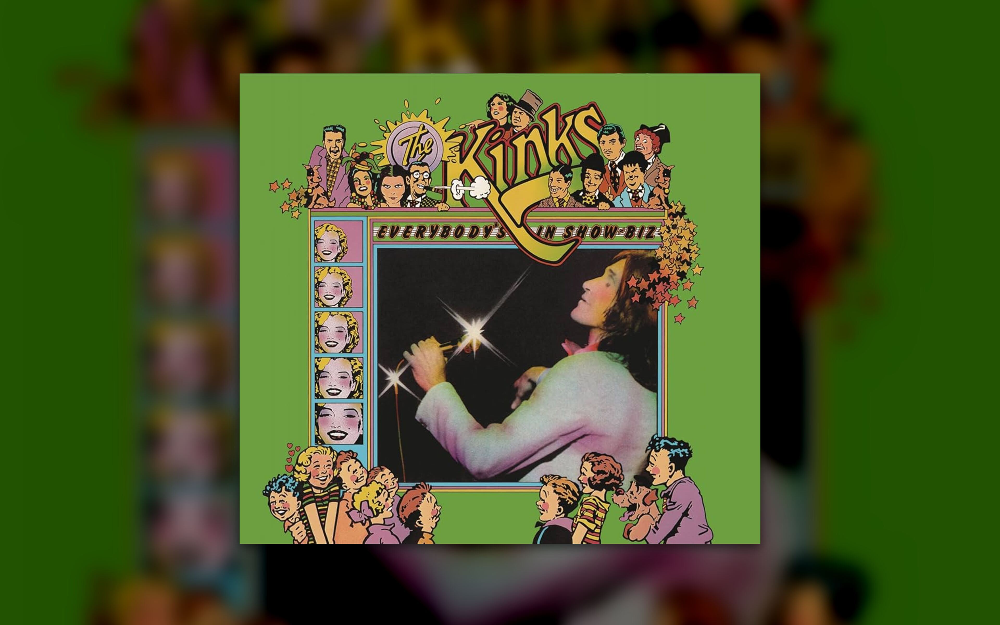
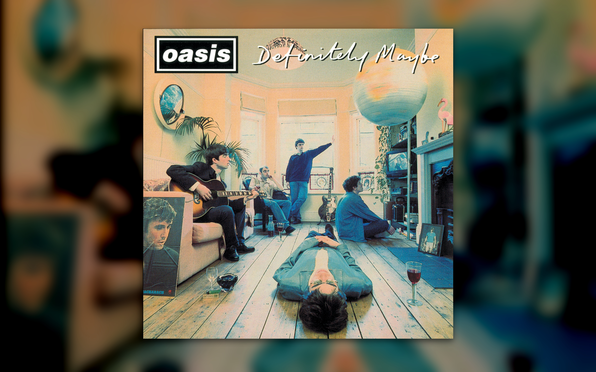
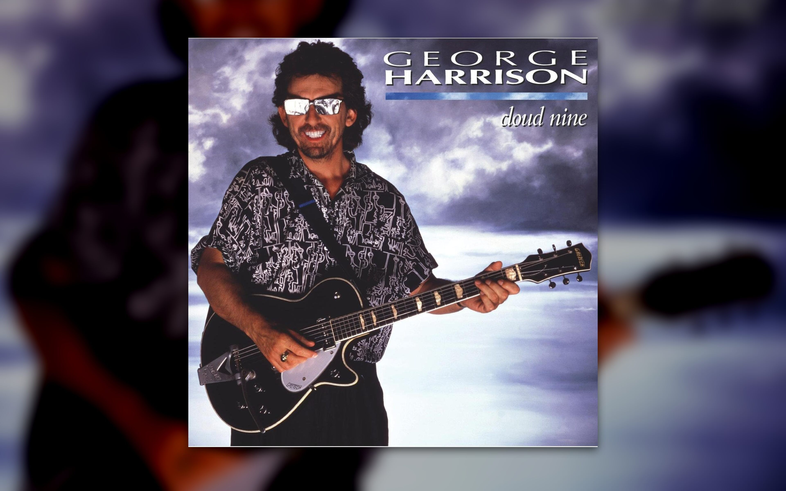
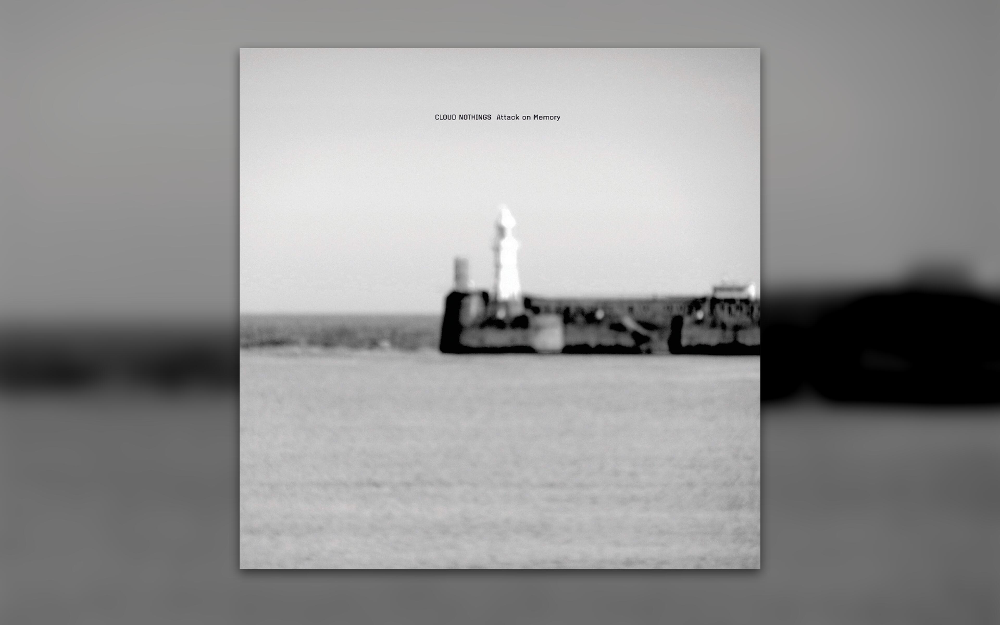

# kewpaper

A tiny Bash utility that uses the currently playing song's album artwork from [kew](https://github.com/ravachol/kew) as a [hyprpaper](https://github.com/hyprwm/hyprpaper) wallpaper.

## Examples













## Requirements

- Hyprland
- hyprpaper
- kew
- gdbus

## Installation

```bash
git clone https://github.com/maxcurnyn/kewpaper.git
cd kewpaper
chmod +x kewpaper
cp kewpaper ~/.local/bin/
```

Make sure `~/.local/bin` is in your `$PATH`.

The default monitor is `eDP-1`. Change it in the script if necessary.

## How to Use

Start kewpaper:

```bash
kewpaper
```

Stop kewpaper:

```bash
kewpaper stop
```

Restart kewpaper (stops the existing background loop and starts a fresh one):

```bash
kewpaper restart
```
